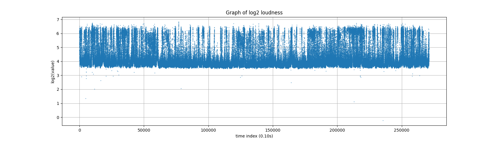

# Sleep sound analysis
 
I've been wondering why I keep waking up tired; so I ran a microphone at night, and analysed the average volume.

Analysing an 8-or-so hour sound file seems like a job for a computer rather than manual listening (even at 2x speed), especially if I want to do this over many nights going forwards. Unfortunately, the results of this show more noise in the "not data" sense than in the "things that might be waking me up" sense, while listening to random segments showed that (1) I do snore, and (2) the tram outside is audible.

Clearly I need a better way to automate this analysis.

